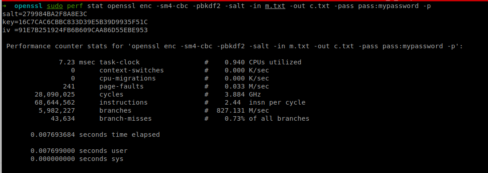

作业1：
从网上搜集DES、AES、TEA和SM4的源码，并在本地环境编译
编写一个小程序，测试四种加密算法的加密速度（用cpu cycles方法，不要用时间）
分别测试CBC和GCM两种工作模式


## AES-CBC

```bash
$ sudo perf stat openssl enc -aes-256-cbc -pbkdf2 -salt -in m.txt -out c.txt -pass pass:mypassword -p
```


## AES-GCM


```bash
import json
from base64 import b64encode
from Crypto.Cipher import AES
from Crypto.Random import get_random_bytes

header = b"header"
data = b"secret"
key = get_random_bytes(16)
cipher = AES.new(key, AES.MODE_GCM)
cipher.update(header)
ciphertext, tag = cipher.encrypt_and_digest(data)

json_k = ['nonce', 'header', 'ciphertext', 'tag']
json_v = [
    b64encode(x).decode('utf-8')
    for x in [cipher.nonce, header, ciphertext, tag]
]
result = json.dumps(dict(zip(json_k, json_v)))
print(result)

```


## DES-CBC


```bash
$ sudo perf stat openssl enc -des-cbc -pbkdf2 -salt -in m.txt -out c.txt -pass pass:mypassword -p
```


## DES-GCM

无

原因：因为GCM是为区块长度为128bits设计的，而DES或者3DES的区块长度是64bits，也有猜测是因为GCM的MAC组件的安全性取决于最长的消息中的块数与多项式字段中的元素数之差。


[参考链接](https://crypto.stackexchange.com/questions/26396/3des-over-galois-counter-mode-gcm-for-authenticated-encryption)


## TEA-CBC

[测试源代码来源（c语言）：Github](https://github.com/dchest/drakon-tea)


## TEA-GCM


待补充


## SM4-CBC

```bash
$ sudo perf stat openssl enc -sm4-cbc -pbkdf2 -salt -in m.txt -out c.txt -pass pass:mypassword -p
```





## SM4-GCM


待补充


从测试过程中观察，各个加密算法中对性能影响最大的子模块（函数）是哪个？

无测试，待补充。


cipher参考链接

[PyCryptodome](https://pycryptodome.readthedocs.io/en/latest/src/introduction.html)


perf参考链接

- [How to Use Perf Performance Analysis Tool on Ubuntu 20.04](https://www.howtoforge.com/how-to-install-perf-performance-analysis-tool-on-ubuntu-20-04/)

- [系统级性能分析工具perf的介绍与使用](https://ivanzz1001.github.io/records/post/linuxops/2017/11/16/linux-perf-usge)

- [perf - check the performance arguments of a program](http://xhyumiracle.com/perf-check-the-performance-arguments-of-a-program/)


- [虚拟机Linux使用perf stat提示cycles not supported](https://www.cnblogs.com/azureology/p/13913540.html)

- [Linux perf-top basics: understand the %](https://blog.dbi-services.com/linux-perf-top-basics-understand-the/)


> # 作业2
>
> # 手机端的随机数产生源:
>
> + ### 软件随机数生成:
>
>   + #### 操作系统随机数生成
>
>     + ##### 如Apple提供了内核中的受信任软件CPRNG, 聚合系统中的原始熵并为内核和用户控件的使用者提供安全的随机数. 作为熵源的因素包括:
>
>       - 安全隔区的硬件 RNG
>       - 启动过程中所收集基于时序的时间误差
>       - 从硬件中断收集的熵
>       - 用于启动过程中保持熵的种子文件
>       - Intel 随机指令，即 RDSEED 和 RDRAND（仅限 macOS）
>
>   + #### 应用内置随机数生成
>
>     + ##### 如微信中的摇骰子功能, 经过测试, 在无互联网连接的时候经过一段等待时间后也会得出结果, 再次连接互联网, 重发此消息, 又会得到不同结果. 我们认为在正常情况下摇骰子应为向服务器请求结果, 但离线时也会得出结果, 说明内置了随机数生成的功能.
>
> + ### 硬件随机数生成:
>
>   + ##### 如Apple设备会将密钥放置在一个安全隔区片上系统(SoC)中加密, 这之中就包含了一个随机数发生器
>
>   + 
>
>   + ##### 三星于2020年发布的`Galaxy A Quantum`手机配备了QRNG芯片(QRNG), 利用CMOS图像传感器捕获的光源散粒噪声产生随机序列
>
> ## 我们认为 三星的QRNG和苹果内置的HRNG可以被认为是"真"随机数


